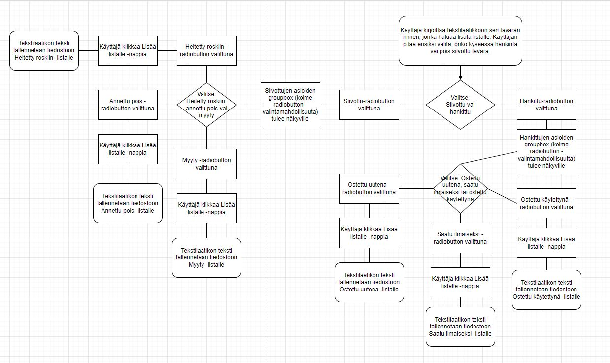
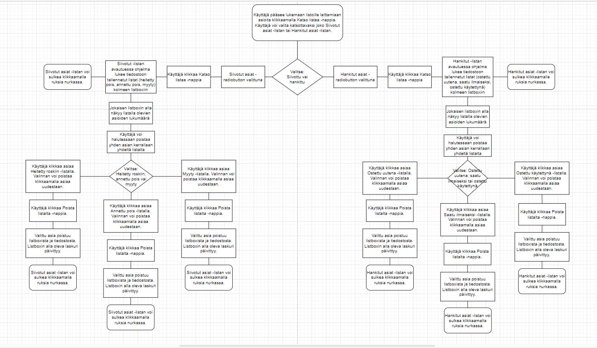
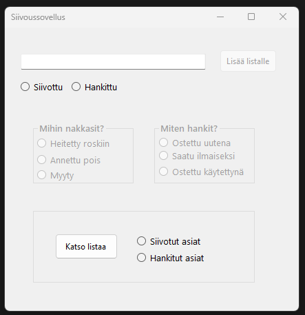
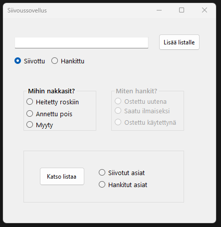
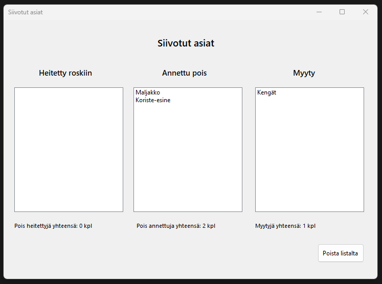
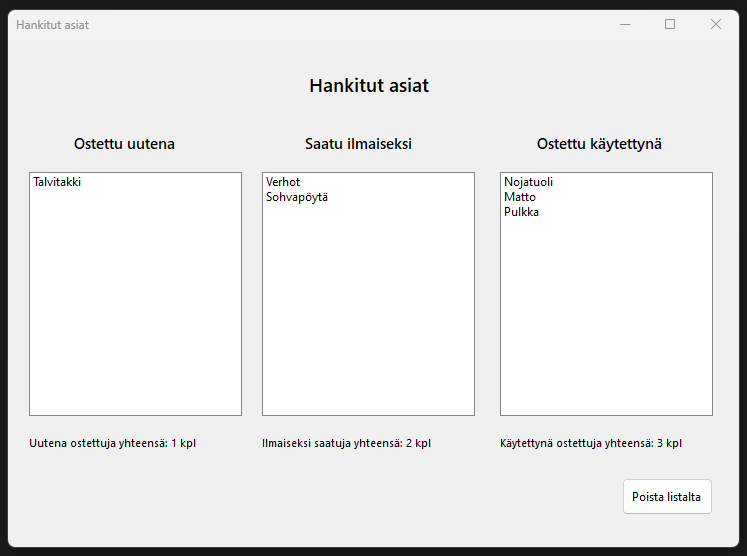

# Sovelluksen toiminta ja käyttötarkoitus
Tähän alle selitystä sovelluksen toiminnasta ja käyttötarkoituksesta
# Vuokaaviot

*Vuokaavio, joka näyttää sovelluksen toiminnan, kun käyttäjä lisää syötteen valitsemalleen listalle.*

*Vuokaavio, joka näyttää sovelluksen toiminnan, kun käyttäjä klikkaa Katso listaa -nappia päänäkymässä.*

# Sovelluksen näkymien esittely

Sovelluksen aloitusnäkymä. Käyttäjän on valittava, lisääkö hän asian Siivotut- listalle vai Hankitut-listalle.

Sovelluksen aloitusnäkymä, kun käyttäjä on valinnut lisäävänsä asian Siivotut-osastolle. Käyttäjän on vielä valittava radiobuttoneiden avulla sopiva lista kolmesta vaihtoehdosta.

*Siivotut asiat -formilta pääsee katsomaan poistettujen tavaroiden listoja.*
*Listoilta voi myös poistaa.*

*Hankitut asiat -formilta pääsee katsomaan hankittujen tavaroiden listoja.*
*Listoilta voi myös poistaa.*
# Koodin pääkohtien esittely
Tähän vissiin koodinpätkiä?
# Jatkokehitysideat
Sovellusta voisi kehittää eteenpäin monella tavalla. Käyttäjä voisi haluta vaikkapa tietää, paljonko ostoksiin on kulunut rahaa, tai paljonko myydyistä tavaroista on tullut rahaa. Sovellukseen voisi lisätä syötteen lisäämisen yhteyteen menoja ja tuloja kirjaavan ominaisuuden. Sovellus voisi myös näyttää käyttäjälle listoille lisättyjä asioita esimerkiksi kuukausi kerrallaan. Tällä hetkellä sovellus näyttää kaikki listoilla olevat asiat yhtenä pötkönä. Sovelluksen ulkonäkö vaatisi myös parantelemista.

